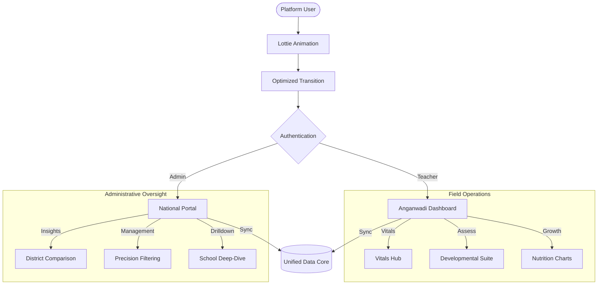

# 🏥 Shishu Suraksha (శిశు సురక్ష)
### *Empowering Early Childhood Development through AI & IoT*

**Shishu Suraksha** is a mission-critical mobile platform designed for Anganwadi workers, ASHA personnel, and Health Administrators. It provides a robust, zero-overflow interface for monitoring, assessing, and intervening in child development across rural and urban India.

---

## 🌟 Key Pillars of the Platform

### 📊 National Admin Portal (G2G)
- **District Analytics**: Compare performance metrics (Bangalore, Mysore, Tumkur, Hassan) in real-time.
- **Critical Oversight**: Automated 'Schools Requiring Attention' list based on health & compliance scores.
- **Alert Resolution**: A centralized hub to manage and resolve high-severity triggers for child malnutrition or developmental delays.

### 👶 Anganwadi Operations (Frontline)
- **Health & Development Suite**:
    - **Live Vitals**: Real-time heart rate and SpO2 monitoring integration.
    - **Growth Monitoring**: Precision tracking against WHO growth standards (Weight-for-Age).
    - **Developmental Milestone Hub**: Formalized Motor, Speech, and Cognitive screening.
- **Intelligent Search**: Find children instantly by Name, ID, or Risk Profile.

### 🤖 Intelligent Assistant & Localization
- **Multi-Lingual AI**: Context-aware assistant supporting Telugu, Hindi, Kannada, and more.
- **Voice-First Experience**: Integrated Speech-to-Text (STT) and Text-to-Speech (TTS) for hands-free operations.
- **Dynamic Greetings**: Time-sensitive, localized dashboard greetings to improve user engagement.

---

## 🛠️ Technological Architecture

| Component | Technology |
| :--- | :--- |
| **Framework** | Flutter (Dart) |
| **State Management** | Riverpod / StateProvider |
| **Visualizations** | FL Chart (Customized for low-end devices) |
| **Intelligence** | Groq (LLaMA-3) & Gemini API |
| **Responsiveness** | Advanced Wrap & Flexible Architecture |
| **Local Data** | Hive / Shared Preferences |

---

## 📊 System Topology

---

*Shishu Suraksha - A step towards an inclusive, healthy, and developed future for every child.* 🇮🇳
