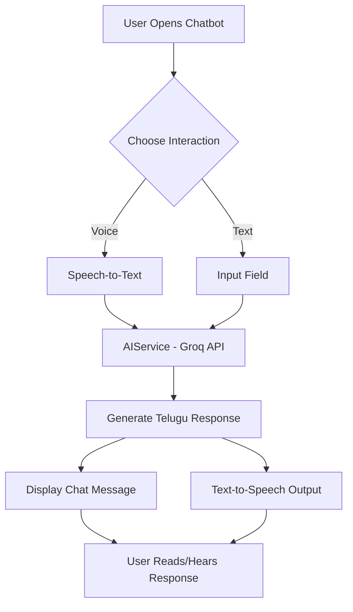

# Shishu Suraksha

Shishu Suraksha is a comprehensive ECD (Early Childhood Development) application designed for Anganwadi teachers and ASHA workers to monitor and support child growth and development.

## 🚀 New Features: Live AI Chatbot

The application now features a "live" AI assistant capable of interacting in multiple regional languages, with **Telugu** as the default.

### Key Capabilities:
- **Intelligent Telugu Interaction**: Powered by Groq (Llama-3), providing fast and professional responses to ECD queries.
- **Voice Response (TTS)**: The assistant reads aloud its responses in the selected language.
- **Speech-to-Text (STT)**: Users can speak their queries directly in Telugu.
- **Responsive Design**: Prevents UI overlap on mobile devices.

## 📊 System Flowchart



## Getting Started

### Environment Variables
Create a `.env` file in the root directory and add your Groq API key:
```env
GROQ_API_KEY=your_api_key_here
```

### Build & Run
1. Install dependencies: `flutter pub get`
2. Run the app: `flutter run`
