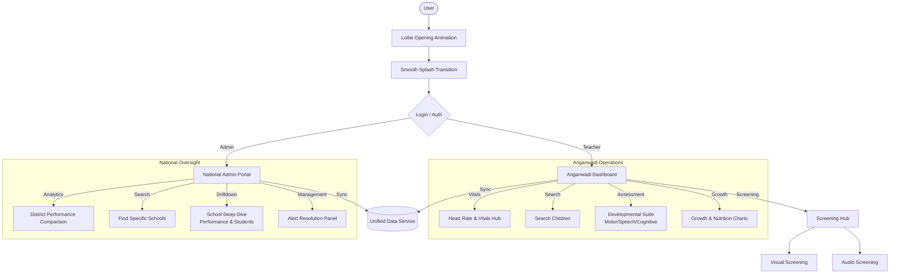

# Shishu Suraksha

Shishu Suraksha is a comprehensive ECD (Early Childhood Development) application designed for Anganwadi teachers and ASHA workers to monitor and support child growth and development.

## 🚀 Newest Features: Health & Admin Suite

The application has been upgraded with a comprehensive and responsive suite for both field workers and regional administrators.

### Key Capabilities:
- **Health & Development Suite**: Integrated vitals monitoring (Heart Rate/SpO2), Growth Tracking (WHO Standards), and Developmental Assessments (Motor/Speech/Cognitive).
- **National Admin Portal**: A high-fidelity dashboard for ministry-level oversight, featuring district performance comparison charts and critical school alerts.
- **Responsive Design**: Zero-overflow UI architecture using `Wrap`, `Flexible`, and `FittedBox` widgets, ensuring a premium experience on any mobile device.
- **Intelligent Search**: Real-time filtering for schools and children across the entire platform.
- **Live AI Chatbot**: Real-time assistant interacting in regional languages (Telugu, Hindi, etc.) with Voice (TTS) and Speech (STT) capabilities.
- **Automated Alerts**: Real-time risk stratification and automated red-flagging for malnourished or high-risk children.

## 📊 System Flowchart



## Getting Started

### Environment Variables
Create a `.env` file in the root directory and add your Groq API key:
```env
GROQ_API_KEY=your_api_key_here
```

### Build & Run
1. Install dependencies: `flutter pub get`
2. Run the app: `flutter run`
